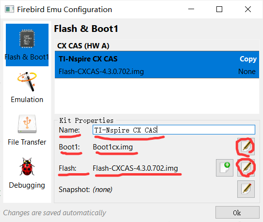
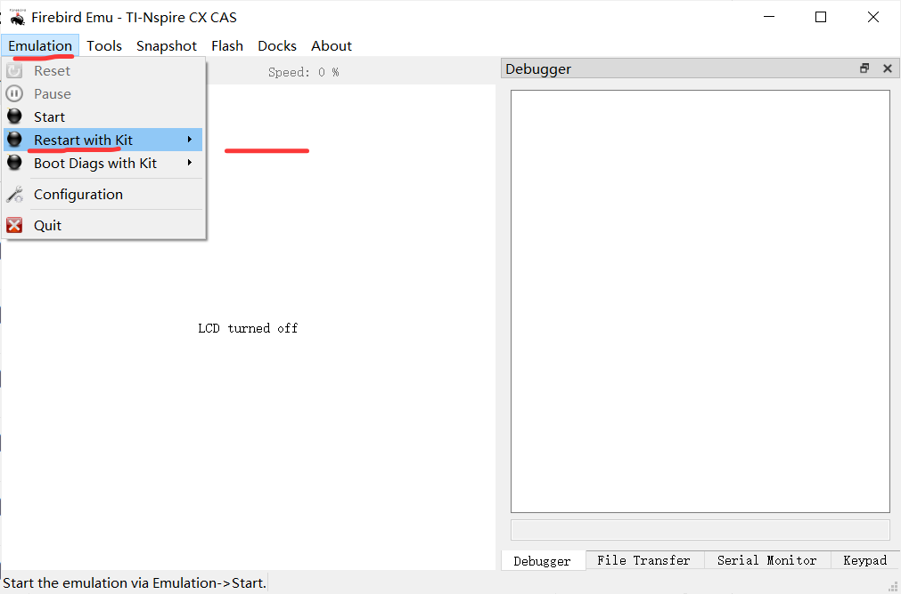

# IB GDC Calculator Emulation Guide 🖩

*A community guide for emulating the IB-approved GDC calculator on desktop/mobile devices for educational purposes.*  

---

## ⚠️ Legal Disclaimer (Read First!)

**This guide does NOT provide or endorse piracy.**  
- You **must own a physical IB GDC calculator** to use this guide **legally**.  
- ROM/flash files are **copyrighted material**.
- Distributing or using copyrighted files without permission is illegal.  
- This guide is for **educational purposes only**.
- **Do not share downloaded files publicly.**  

---

## 🖥️ Platform Notes
- **Windows/macOS/Linux/Android**: Fully supported.  
- **iOS**: Jailbreaking required *(not recommended)*.

---

## 🔗 Full Detailed Guide
For comprehensive instructions, refer to:  
**[How to Emulate TI-Nspire CX CAS Touchpad on Mac/Windows/Linux with Firebird](https://www.intereseducation.com/resources/how-to-emulate-ti-nspire-cx-cas-touchpad-on-mac-windows-linux-with-firebird/)**  

For the Chinese version of this guide, visit:  
**[IB GDC计算器模拟指南 (中文版)](README_CN.md)**  

---

## 🛠️ Setup Guide

### Step 0: Download Required Files
1. **Download Firebird Emulator**:  
   - Visit [Firebird Releases](https://github.com/nspire-emus/firebird/releases/latest).  
   - Download the correct version for your OS (Windows/macOS/Linux).  
   - Unzip the files into a folder (e.g., `firebird-emu`).   

2. **Acquire Boot1 and Flash Files**:  
   - Follow **[this external guide](https://www.intereseducation.com/resources/how-to-emulate-ti-nspire-cx-cas-touchpad-on-mac-windows-linux-with-firebird/)** *(Note: We do not endorse or host these files)*.  
   - Download the `Boot1` and `Flash` files from the link provided at the end of the guide.  
   - Unzip them into your `firebird-emu` folder.  

---

### Step 1: Configure Boot1 and Flash
1. **Launch Firebird**:  
   - Open the `firebird-emu` folder and run `firebird.exe` (Windows) or the executable for your OS.  

2. **Configure Emulator**:  
   - Go to `Emulation > Configuration > Flash & Boot1`.  
   - **Name**: Enter `TI-Nspire CX CAS`.  
   - **Boot1**: Select the `Boot1` file you downloaded.  
   - **Flash**: Select the `Flash` file you downloaded.  
   - Ignore "Snapshot" for now. Click **OK**.  

     

---

### Step 2: Install and Run
1. **Start Emulation**:  
   - Go to `Emulation > Restart with Kit > TI-Nspire CX CAS`.  

2. **Complete Setup**:  
   - When prompted, press **`I`** on the keyboard to initialize.  
   - Wait for the emulator to load (may take 1-2 minutes).  

     
