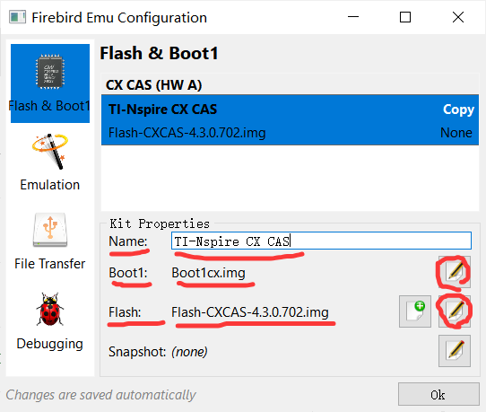
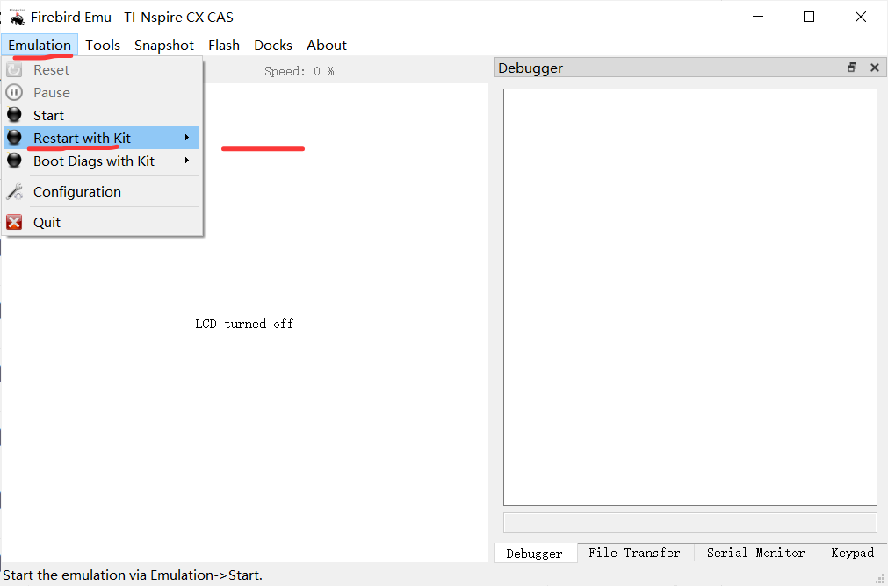

# IB GDC计算器模拟指南 🖩

*本指南旨在指导用户在桌面/移动设备上模拟GDC计算器，仅供学习用途。*

---

## ⚠️ 法律免责声明（请先阅读）

**本指南不提供或支持盗版。**
- 要合法使用本指南，您 **必须拥有实体IB GDC计算器**。
- ROM/Flash文件受 **版权保护**。
- 未经授权传播或使用受版权保护的文件是非法的。
- 本指南仅供 **教育用途**。
- **请勿公开分享下载的文件。**

---

## 🖥️ 适用平台
- **Windows/macOS/Linux/Android**: 完全支持。
- **iOS**: 需要越狱 *(不推荐)*。

---

## 🔗 详细指南
完整的详细指南请参考：  
**[如何在Mac/Windows/Linux上使用Firebird模拟TI-Nspire CX CAS计算器](https://www.intereseducation.com/resources/how-to-emulate-ti-nspire-cx-cas-touchpad-on-mac-windows-linux-with-firebird/)**  

---

## 🛠️ 设置指南

### 步骤 0：下载所需文件
1. **下载 Firebird 模拟器**：
   - 访问 [Firebird Releases](https://github.com/nspire-emus/firebird/releases/latest)。
   - 下载适用于您的操作系统（Windows/macOS/Linux）的版本。
   - 解压缩文件到文件夹（例如 `firebird-emu`）。

2. **获取 Boot1 和 Flash 文件**：
   - 请参考 **[此外部指南](https://www.intereseducation.com/resources/how-to-emulate-ti-nspire-cx-cas-touchpad-on-mac-windows-linux-with-firebird/)** *(注意：我们不提供或托管这些文件)*。
   - 从指南末尾提供的链接下载 `Boot1` 和 `Flash` 文件。
   - 解压缩到 `firebird-emu` 文件夹。

---

### 步骤 1：配置 Boot1 和 Flash
1. **启动 Firebird**：
   - 打开 `firebird-emu` 文件夹，运行 `firebird.exe`（Windows）或相应操作系统的可执行文件。

2. **配置模拟器**：
   - 进入 `Emulation > Configuration > Flash & Boot1`。
   - **名称**：输入 `TI-Nspire CX CAS`。
   - **Boot1**：选择已下载的 `Boot1` 文件。
   - **Flash**：选择已下载的 `Flash` 文件。
   - 先忽略 "Snapshot"，然后点击 **OK**。

   

---

### 步骤 2：安装与运行
1. **启动模拟**：
   - 进入 `Emulation > Restart with Kit > TI-Nspire CX CAS`。

2. **完成设置**：
   - 提示时，按键盘上的 **`I`** 进行初始化。
   - 等待模拟器加载（可能需要1-2分钟）。

   
